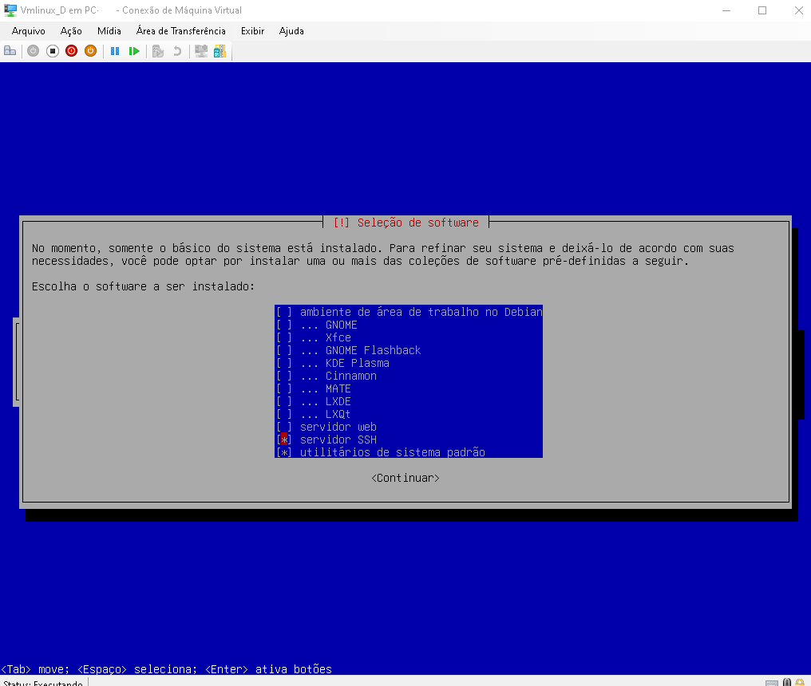

# Script Docker [](http://makeapullrequest.com) [](https://github.com/fabiuniz/repo/issues) 

## 🚀 Sobre o Projeto
Este repositório é um exemplo de como montar um script para criar um docker contendo Python e configurar um ssl local autoassinado criando e com banco de dados MYSQL assim o seu ambiente de desenvolvimento de forma automatizada.

Profissionais que atuam na prática de DevOps são responsáveis por automatizar processos de desenvolvimento e operação. Eles geralmente têm experiência com ferramentas de containerização como Docker e são capazes de criar e gerenciar ambientes de desenvolvimento, teste e produção de forma eficiente.

Os testes foram feitos no debian 12 rodando dentro do Hyper-V ou WSL2, após a instalação do linux ainda pode levar vários minutos (~20 minutos) para rodar a primeira vez devido a quantidade de pacotes a serem baixados, mas depois vai ficar mas rápido nas proximas vezes já que os mesmos estarão no cache.<br> 

Requisitos de sistema:

[debian-12.5.0-amd64-netinst.iso](https://get.debian.org/images/archive/12.5.0/amd64/iso-cd/debian-12.5.0-amd64-netinst.iso)

```bash
debian-12.5.0-amd64-netinst.iso
Brasil português
Escolha o seu hostname preferido, nesse caso usei "vmlinuxd" (ajustar no arquivo script.cfg) 
Servidor SSH
Utilitario de sistema padrão
```


Estrutura base do repositório 

```bash

Projeto Script_Docker/
│   script_docker/
│   ├── Scripts/
│   │   ├── lib_bash.sh/     # Biblioteca de funções bash para facilitar reusando rotinas
│   │   ├── script.cfg       # Parametro de configurção para iniciar script
│   ├── images/
│   ├── putsourcehere/
│   │   ├── requirements.txt
│   │   LICENSE
│   │   README.md
│   │   setup_script_launcher.sh # Script para criar e iniciar webservice usando docker  

``````

Com o sistema linux com superuser instalado e configurado com acesso SSH agora podemos rodar os scripts:

ssh userlnx@vmlinuxd

Dentro da pasta home da sua instalação linux rodar: 

```bash
cd /home/userlnx
apt-get install -y dos2unix
apt-get install git
apt-get update
rm -rf docker
mkdir -p docker
cd docker
git clone https://github.com/fabiuniz/script_docker.git
cd script_docker
git checkout OPTIMIZE
chmod -R 777 .. # ../..
dos2unix setup_script_launcher.sh
setapplications "py-app my-db" #"nginx py-app my-db java-app react-app php-app android-dev android-emulator"
.  setup_script_launcher.sh

```

🛠️ setup_script_launcher.sh<br> 
- [SCRIPT](putsourcehere) veja aqui detalhadamente os passos que serão realizado para criar e iniciar um docker webservice usando docker com python <br>
