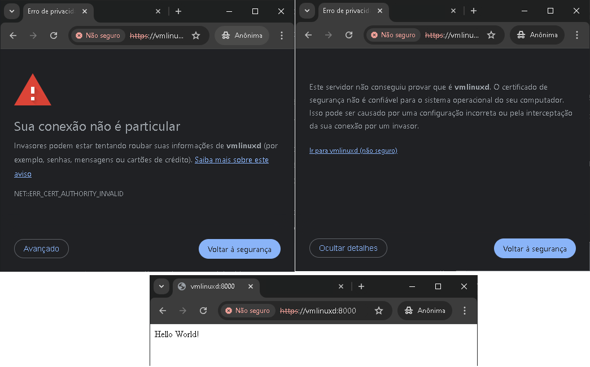

# Script Docker Python [](http://makeapullrequest.com) [](https://github.com/fabiuniz/repo/issues) 

## 🚀 Sobre o Projeto
Este repositório é um exemplo de como montar um script para criar um docker contendo Python rodando no nginx e configurar um ssl local autoassinado criando assim o seu ambiente de desenvolvimento de forma automatizada.


Os testes foram feitos no debian 12 rodando dentro do Hyper-V, pode levar vários minutos para rodar a primeira vez devido a quantidade de pacotes a serem baixados, mas depois vai ficar mas rapido nas proximas vezes já que os mesmos estarão no cache  e o arquivo [SCRIPT](setup_script_launcher_py.sh) vai seguir esse roteiro dos passos logo abaixo :


Verja os requisitos para o sitema aqui: [SCRIPT](../) que vai rodar:

```bash

putsourcehere_py/
│   Scripts/
│   ├── lib_bash.sh/     # Biblioteca de funções bash para facilitar reusando rotinas
│   ├── script.cfg           # Configurção de inicialização 
├── README.md
├── requirements.txt     # Pacotes para uso da aplicação

```

Informações descritivas do que o arquivo [SCRIPT](../setup_script_launcher_py.sh) vai rodar:

🐋 Preparação: Personalizando webserver
- Instalar dependência e rodar esse comando caso o bash dar erro de formato unix do arquivo quando tentar rodar esse script <br>
  - apt-get install -y dos2unix <br>
  - dos2unix setup_script_docker_py.sh # convertendo formato do arquivo <br>
- Importando  source da Biblioteca de funções bash (lib_bash.sh)
- Importando source de Configurações da aplicação (script.cfg)
- construindo .sh para Iniciar docker <br>
  - Construir e subir os containeres <br>
  - Verificar se os serviços estão rodando <br>
  - Nota: Caso o serviço Apache ou Nginx já existente esteja usando as portas 80 e 443, <br>
  certifique-se de parar ou reconfigurá-lo para evitar conflitos de porta. <br>
  - construindo .sh para parar docker <br>
  - app_name="${app_name}"

🐋 Passo 1: Verificar e instalar Docker e Docker Compose <br>

📁 Passo 2: Criaço da Estrutura de Diretórios <br>

📝 Passo 3: Criar o arquivo app.py com ssl <br>
- Configura o CORS para permitir todas as origens e credenciais <br>
- Caminho para o certificado SSL e a chave privada <br>
- Configurações de contexto SSL <br>

📄 Passo 4: Criar o arquivo requirements.txt <br>
- Nota: Caso poderá acressentar novos pacotes para sua aplicação aqui <br>
🛠️ Passo 5: Criar o Dockerfile para a aplicação Flask <br>
- Usar a imagem base Python <br>
- Instalar Node.js <br>
- Instalar Tesseract OCR <br>
- Definir o diretório de trabalho no continer <br>
- Copiar o arquivo requirements.txt para o contêiner <br>
- Instalar as dependências <br>
- Copiar os arquivos necessários <br>
- Expor a porta que a aplicação Flask vai usar <br>
- Comando para iniciar a aplicação <br>

⚙️ Passo 6: Criar o arquivo de configuraço do Nginx com ssl(nginx.conf) <br>

🧩 Passo 7: Criar o arquivo docker-compose.yml <br>
- Caso tenha conteúdo na pasta app_source copia sobrepondo existentes <br>

🔒 Passo 8: Gerar um certificado SSL autoassinado (opcional) <br>

🚀 Passo 9: Construir e subir os containeres <br>

✅ Passo 10: Verificar se os serviços estão rodando <br>
- Parar e remover contêiner existente, se necessário (Desmontando unidade) <br>
- Criar e executar um novo contêiner com volume montado <br>
- Limpeza <br>
- Remover contêineres parados (sem afetar volumes ou imagens) <br>
- Remover imagens dangling (sem tags) e liberar espaço sem afetar as imagens usadas <br>
- Remover volumes que não estão sendo usados por nenhum contêiner ativo <br>
- Finalizando <br>
- Nota: Caso o serviço Apache ou Nginx já existente esteja usando as portas 80 e 443, <br>
- certifique-se de parar ou reconfigur-lo para evitar conflitos de porta. <br>

```bash
Status: Downloaded newer image for nginx:latest
Creating script_docker_py_app ... done
Creating script_docker_py_nginx ... done
         Name                       Command               State                                   Ports
----------------------------------------------------------------------------------------------------------------------------------------
script_docker_py_app     python app.py                    Up      0.0.0.0:8000->8000/tcp,:::8000->8000/tcp
script_docker_py_nginx   /docker-entrypoint.sh ngin ...   Up      0.0.0.0:443->443/tcp,:::443->443/tcp, 0.0.0.0:80->80/tcp,:::80->80/tcp
```
